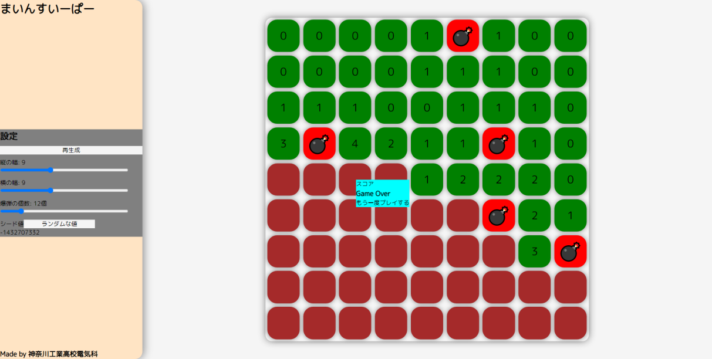
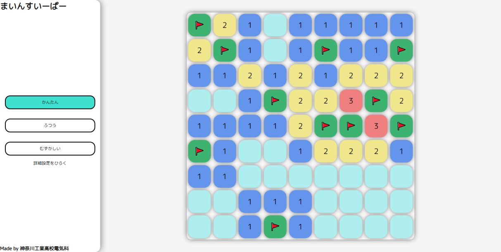
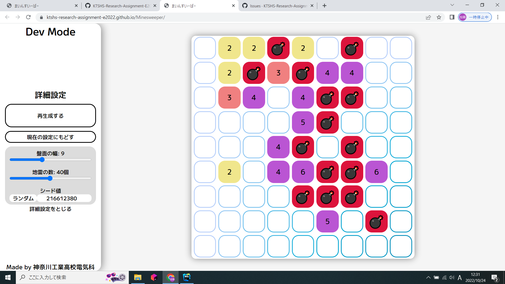
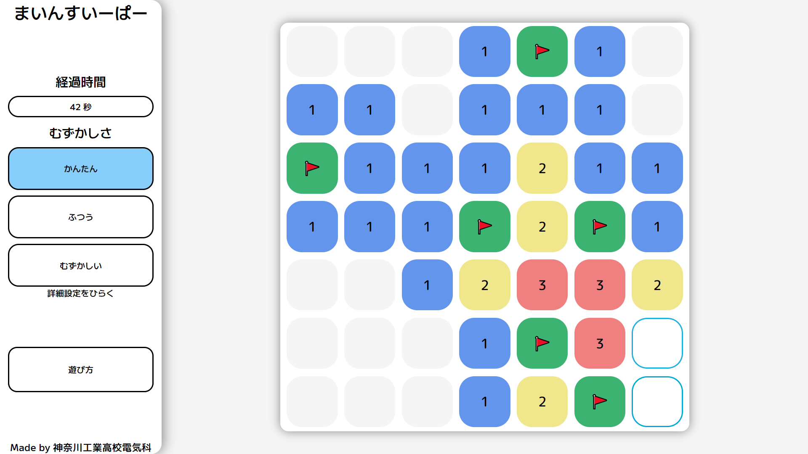
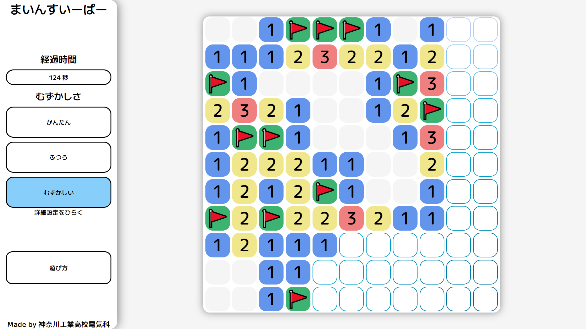

# マインスイーパーを作ってみて感じたこと / 製作途中の様子

## 全体を通して

ゲームを作るにあたって、WEBで遊べるようにしたいということで、JS系 or Unity で作ろうかというように最初は考えた。

しかし、作るゲームが簡単に遊べるボードゲーム(当初はマインスイーパーと決めていなかった)ということで、詳細なグラフィックは求められないこと、 Unity を使用した開発経験があるメンバーがいなかった(そもそもプログラミング経験者が一人しかいない)ことからJS系に決定した。

JSならば React or Vue のどちらかのライブラリを使用しようと考えたが、唯一の経験者加藤は WEB で幾度も挫折していて、できることならば JavaScript を使いたくなかった。また、プログラム初心者に JavaScript を教えられる自信がなかった。そこで、加藤が経験のある Kotlin で作ろうと考えた。

Kotlin には WEB へのアプローチがいくつかあった。 Kotlin/JS と Jetpack Compose for Web, KorGe である。当初はスマホアプリへの展開も視野に入れていたこと、WEBへの展開がメインだったことから、 Jetpack Compose for Web を使用することにした。

Jetpack Compose for Web は v1.0 がリリースした直後であったため日本語の記事等があまり存在しておらず最初は苦労した。しかし、英語の資料をGoogle翻訳を使用して読んでいくうちに英語力がついていき、英語の点数もあがり、英語もある程度読めるようになった。また、プログラムへの知識も深められ、とても良い経験となった。

ロジックは書いてみたら意外と簡単だった。12月中に1週間もかけずに完成したが、重大なバグが2つほどあった。プログラムのスキルが約1年間で向上し、後々見たら色々と改善したくなり、可読性を上げるために何度か書き直した。

後述するが、デザインが大変だった。というか12月中にほとんど完成させてしまったためにデザインくらいしか作る部分がなかった。

モチベーションがなくなってしまったために、途中から開発速度が0に近くなった。それなりのものはできたので後悔はしていない。

## 大変だったこと

一番時間を要したのはプログラムではなく、デザインだった。

メンバーの誰にも特にセンスがあるわけでもなく、まさに手探りで作り上げた。

## 後悔したこと

途中DLしてオフラインでも遊べるように出来たらいいのではと先生に提案され、Web App に対応させようとしたが、キャッシュの扱いに難儀してすべて切り戻して諦めた。もし、このプロジェクトを継いでくれる人がいるなら、ぜひ対応させてほしい。(いないと思うけど)

## 数少ないスクショコーナー

もっと撮るべきだった

最初期の仮デザイン なんか小豆色してる

色をいい感じにして、難易度で設定が可能なようにした。

ほとんどデザインが固まってきた 一枚前から期間が相当空いている

経過時間表示が追加された

遊び方ボタンが追加された 文字が大きくなった